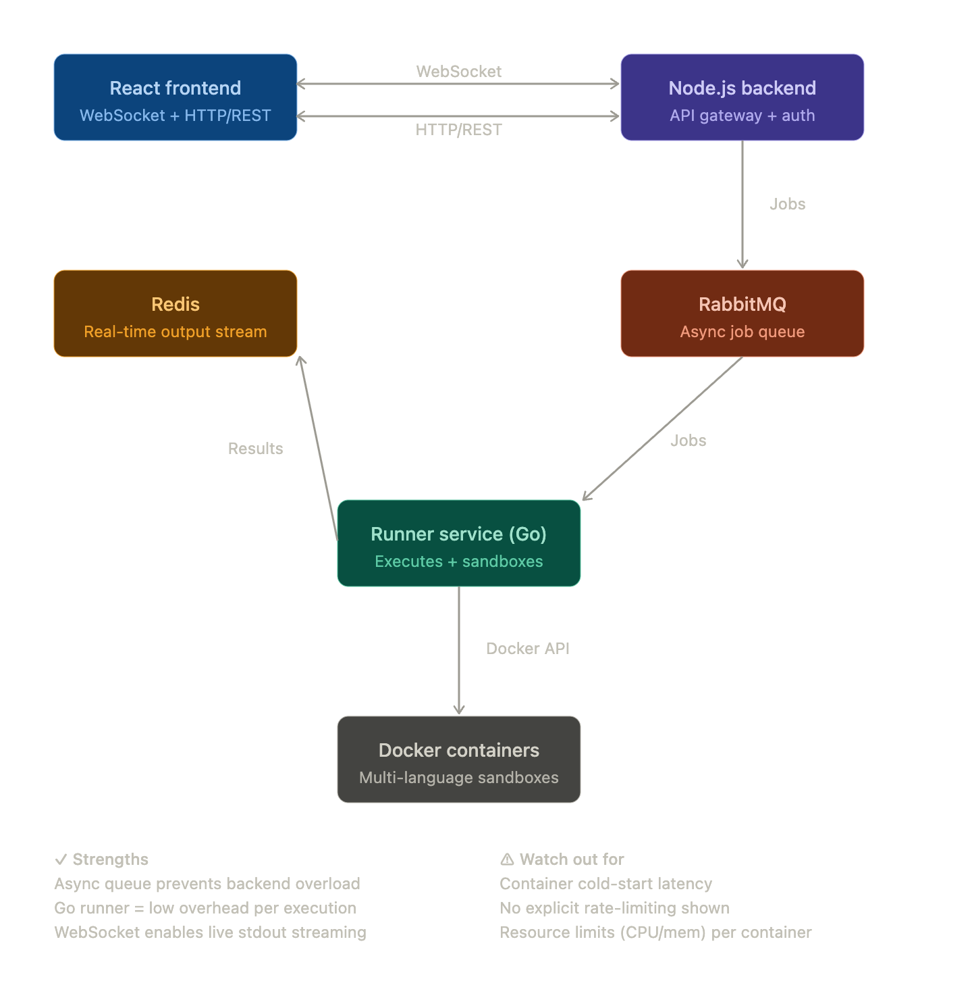

# Online Code Compiler

A production-ready online code execution API written in Go. Executes code securely inside isolated Docker containers with real-time output streaming via SSE (Server-Sent Events).



## How It Works

```
POST /api/v1/task          → submit code, receive job_id immediately
GET  /api/v1/task/:id      → connect via SSE, receive output in real time
```

Code never touches the host filesystem. Each execution runs in a fresh, isolated Docker container that is automatically removed after completion.

## Supported Languages

| Language   | Image                    | Strategy                         |
|------------|--------------------------|----------------------------------|
| Python     | python:3.11-alpine       | `-c` flag (no file, no mount)    |
| JavaScript | node:18-alpine           | `-e` flag (no file, no mount)    |
| C          | gcc:13                   | stdin compile → named volume     |
| C++        | gcc:13                   | stdin compile → named volume     |
| Go         | golang:1.22-alpine       | tmpfs + env var → named volume   |
| Java       | amazoncorretto:17-alpine | tmpfs + env var → named volume   |

## API

### `POST /api/v1/task`

Submit code for execution. Returns a job ID immediately — does not block.

**Request body:**
```json
{
  "language": "python",
  "code": "print('hello world')",
  "stdin": ""
}
```

**Response:**
```json
{
  "task_id": "b5d86dc5-0cd5-429d-a4af-f84252d8d0f1"
}
```

**Limits:**
- Code: max 50KB
- Stdin: max 10KB
- Rate limit: 10 requests/minute per IP (burst of 5)

---

### `GET /api/v1/task/:id`

Stream execution results via SSE. Use the browser's `EventSource` API to connect.

**SSE Events:**

| Event   | Data            | Description                      |
|---------|-----------------|----------------------------------|
| `stdout`| string          | One line of program stdout       |
| `stderr`| string          | One line of program stderr       |
| `done`  | exit code (int) | Execution finished (0 = success) |
| `error` | string          | Internal or sandbox error        |

**Browser example:**
```javascript
const es = new EventSource(`/api/v1/task/${taskID}`)

es.addEventListener('stdout', (e) => console.log(e.data))
es.addEventListener('stderr', (e) => console.error(e.data))
es.addEventListener('done', (e) => {
  console.log('exit code:', e.data)
  es.close()
})
es.addEventListener('error', (e) => {
  console.error('error:', e.data)
  es.close()
})
```

---

### `GET /api/v1/languages`

Returns the list of supported languages.

**Response:**
```json
{
  "languages": ["go", "python", "javascript", "java", "cpp", "c"]
}
```

---

### `GET /health`

Health check endpoint.

```json
{ "status": "ok" }
```

---

### `GET /swagger/*any`

Swagger UI for interactive API documentation.

## Configuration

All configuration is via environment variables:

| Variable      | Description                    | Required |
|---------------|--------------------------------|----------|
| `ENVIRONMENT` | `development` or `production`  | ✅       |
| `HTTP_HOST`   | Server bind host               | ✅       |
| `HTTP_PORT`   | Server bind port               | ✅       |

Container resource limits are hardcoded in `internal/bootstrap/builder.go`:

| Limit    | Value              |
|----------|--------------------|
| Memory   | 512 MB             |
| CPU      | 1 core (100000 μs) |
| PIDs     | 64                 |
| Timeout  | 30 seconds         |
| Network  | Disabled           |

## Running Locally

**Prerequisites:** Go 1.22+, Docker

```bash
git clone https://github.com/diyor200/online-code-compiler.git
cd online-code-compiler

export ENVIRONMENT=development
export HTTP_HOST=0.0.0.0
export HTTP_PORT=8080

go run ./cmd/main.go
```

Open `test.html` in your browser to use the built-in test UI.

## Running with Docker

```bash
docker build -t online-compiler .

docker run -d --name online-compiler \
  -p 8080:8080 \
  -e ENVIRONMENT=production \
  -e HTTP_HOST=0.0.0.0 \
  -e HTTP_PORT=8080 \
  -v /var/run/docker.sock:/var/run/docker.sock \
  online-compiler
```

> The Docker socket is mounted so the service can spawn execution containers. Always run behind a firewall — never expose the socket directly to the internet.

## CI/CD

GitHub Actions pipeline runs on every push to `main`:

```
push to main
    │
    ├── build   →  go vet + go test
    ├── docker  →  build & push image to Docker Hub
    └── deploy  →  SSH into AWS EC2, pull & restart container
```

### Required GitHub Secrets

| Secret                | Description              |
|-----------------------|--------------------------|
| `DOCKER_USERNAME`     | Docker Hub username      |
| `DOCKER_ACCESS_TOKEN` | Docker Hub access token  |
| `AWS_HOST`            | EC2 public IP/hostname   |
| `AWS_USER`            | EC2 SSH username         |
| `AWS_SSH_KEY`         | EC2 SSH private key      |
| `HTTP_PORT`           | Port to expose on EC2    |
| `HTTP_HOST`           | Host to bind on EC2      |

## Security

- Each run gets a **fresh isolated container** — no shared state between executions
- **Network disabled** by default — user code cannot make outbound requests
- **PID limit (64)** prevents fork bombs
- **Memory and CPU limits** prevent resource exhaustion
- **No host bind mounts** — safe for Docker-in-Docker deployments
- **Rate limiting** per IP prevents API abuse
- Containers are **force-removed** after execution regardless of exit status

## Makefile

```bash
make swag-init   # regenerate Swagger docs from annotations
```

## License

MIT